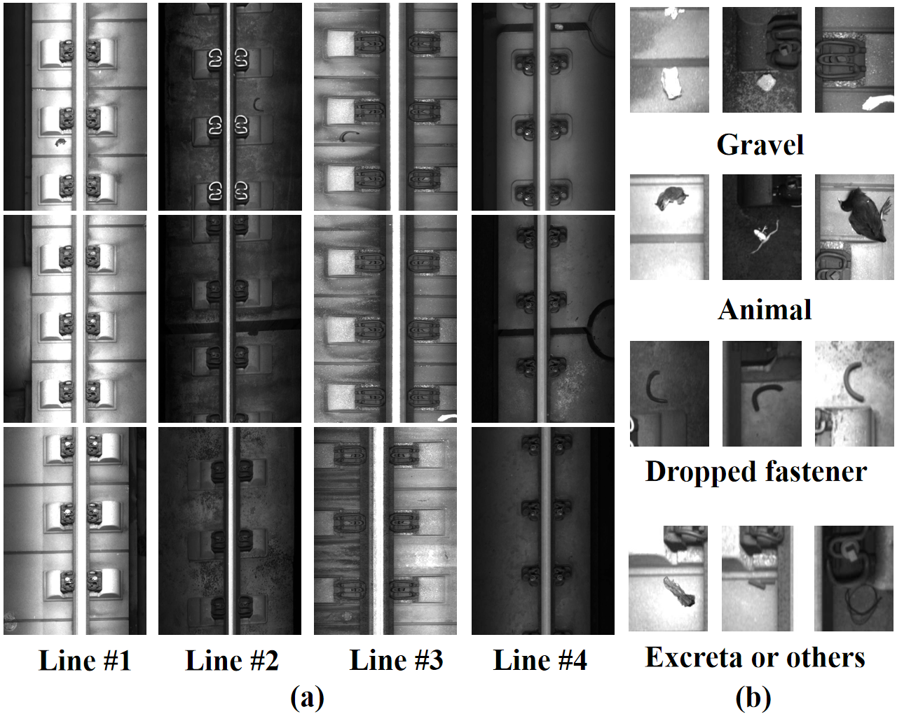

# Railway-Abnormal-Dataset

The raw dataset:
https://pan.baidu.com/s/1KSnHS5lfFU08MdJN5cDwFw  kzs8 

This link provided a preview of our railway abnormal detection dataset.

# Description
We designed a benchmark dataset of abnormal object detection for railway inspection.
* The images are mainly collected from 4 real railway lines which opened in different years and are located in various areas. 
* The main visual dissimilarity depends on that each rail has adopted different types of slabs. 
* The dataset also involves a rich diversity including rail fastener type, the lighting condition and image gray distribution.
* Data augmentation methods are used to expand the size of our dataset.
* The resolution for each image is 800px * 1160px.

# Examples

The image below shows some example images of the 4 lines and several types of abnormal objects.

More data will be released here later.